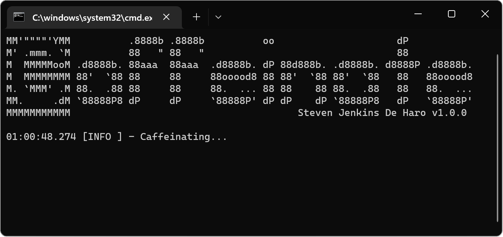

# Caffeinate

[](https://github.com/StevenJDH/caffeinate/actions/workflows/maven-sonar-workflow.yml)


[](https://www.codacy.com/gh/StevenJDH/caffeinate/dashboard?utm_source=github.com&amp;utm_medium=referral&amp;utm_content=StevenJDH/caffeinate&amp;utm_campaign=Badge_Grade)
[](https://sonarcloud.io/summary/new_code?id=StevenJDH_caffeinate)
[](https://sonarcloud.io/summary/new_code?id=StevenJDH_caffeinate)
[](https://sonarcloud.io/summary/new_code?id=StevenJDH_caffeinate)
[](https://sonarcloud.io/summary/new_code?id=StevenJDH_caffeinate)
[](https://sonarcloud.io/dashboard?id=StevenJDH_caffeinate)
[](https://sonarcloud.io/summary/new_code?id=StevenJDH_caffeinate)
[](https://sonarcloud.io/summary/new_code?id=StevenJDH_caffeinate)
[](https://sonarcloud.io/summary/new_code?id=StevenJDH_caffeinate)


Caffeinate is a simple tool that prevents a computer from entering lock mode while preventing communication apps from switching to the inactive status. There are many benefits as to why this would be useful, but the main reason why this tool was created was to prevent missed calls due to the screen locking. Depending on the system configuration, when the screen is locked, calls and chat notifications can be muted, and it is not always possible to customize the lock screen settings due to GPO policies. Likewise, today, many communication apps do not allow disabling the inactive status, which can be set too low by default. Caffeinate resolves all of these challenges without making any changes to the system.



[](https://www.buymeacoffee.com/stevenjdh)

Releases: [https://github.com/StevenJDH/caffeinate/releases](https://github.com/StevenJDH/caffeinate/releases)

## Features
* Prevents computer from entering lock mode.
* Prevents inactive status in apps like Teams, Skype, etc.
* Global hotkey to exit the app (decaffeinated).
* Supports Windows, macOS, and Linux.

## Prerequisites
* Java 11+ ([Temurin/Adopt](https://adoptium.net)) OpenJDK
* [Maven](https://maven.apache.org) 3.8.1+ CLI

## Usage
Just open the tool either by clicking on the file directly, or through the console with the `java -jar caffeinate-1.0-bin.jar` command. After, there should be a message that says `caffeinating` to indicate the app is working. To exit properly, use the global hotkey combination `Ctrl` + `X` + `C`.

## GPG integrity check
I have digitally signed all releases. To make use of this for integrity checks, download my public key from the Ubuntu Key Server into your keyring using the following command:

```bash
gpg --keyserver keyserver.ubuntu.com --recv-keys 2631EDD2F6035B6B03A590147C7EF877C4E5B44E
```

Then, download the associated *.asc file for the release to verify with the following command to perform the check:

```bash
gpg --verify caffeinate-1.0.0-bin.jar.asc caffeinate-1.0.0-bin.jar
```

There should be a good signature response in the output if the integrity check passed. If not already installed, see [GnuPG Binary Releases](https://gnupg.org/download/index.html) for the needed OS.

## Disclaimer
Hue Meetings is distributed in the hope that it will be useful, but WITHOUT ANY WARRANTY; without even the implied warranty of MERCHANTABILITY or FITNESS FOR A PARTICULAR PURPOSE. See the GNU General Public License for more details.

## Contributing
Thanks for your interest in contributing! There are many ways to contribute to this project. Get started [here](https://github.com/StevenJDH/.github/blob/main/docs/CONTRIBUTING.md).

## Do you have any questions?
Many commonly asked questions are answered in the FAQ:
[https://github.com/StevenJDH/caffeinate/wiki/FAQ](https://github.com/StevenJDH/caffeinate/wiki/FAQ)

## Want to show your support?

|Method       | Address                                                                                                    |
|------------:|:-----------------------------------------------------------------------------------------------------------|
|PayPal:      | [https://www.paypal.me/stevenjdh](https://www.paypal.me/stevenjdh "Steven's Paypal Page")                  |
|Bitcoin:     | 3GyeQvN6imXEHVcdwrZwKHLZNGdnXeDfw2                                                                         |
|Litecoin:    | MAJtR4ccdyUQtiiBpg9PwF2AZ6Xbk5ioLm                                                                         |
|Ethereum:    | 0xa62b53c1d49f9C481e20E5675fbffDab2Fcda82E                                                                 |
|Dash:        | Xw5bDL93fFNHe9FAGHV4hjoGfDpfwsqAAj                                                                         |
|Zcash:       | t1a2Kr3jFv8WksgPBcMZFwiYM8Hn5QCMAs5                                                                        |
|PIVX:        | DQq2qeny1TveZDcZFWwQVGdKchFGtzeieU                                                                         |
|Ripple:      | rLHzPsX6oXkzU2qL12kHCH8G8cnZv1rBJh<br />Destination Tag: 2357564055                                        |
|Monero:      | 4GdoN7NCTi8a5gZug7PrwZNKjvHFmKeV11L6pNJPgj5QNEHsN6eeX3D<br />&#8618;aAQFwZ1ufD4LYCZKArktt113W7QjWvQ7CWDXrwM8yCGgEdhV3Wt|


// Steven Jenkins De Haro ("StevenJDH" on GitHub)
